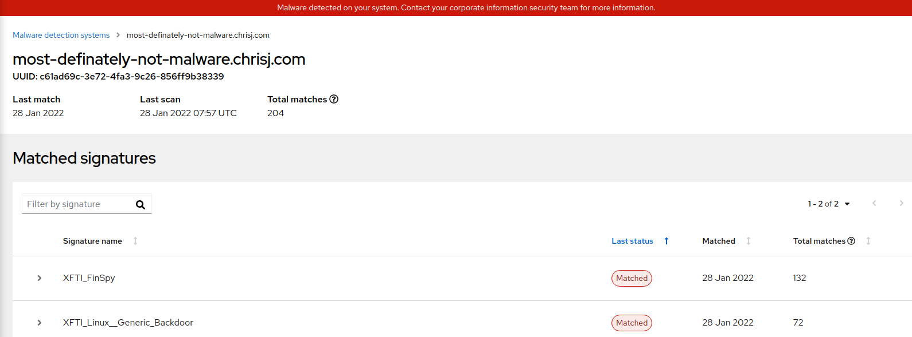

# malware-playbooks
This playbook contains a selection of tasks to test out some malware signatures which are picked up by yara/Red Hat Insights.  
Please not that there are *no* live malware binaries here - just signatures which spoof malware incidents.

## Pre-Reqs
 - The RHEL server must be registered to Red Hat Insights:
```
$ sudo yum -y install insights-client
$ sudo insights-client --register
```

The playbook will enable the EPEL repository to install the yara package.

The playbook will carry out the following actions:
- Ensure EPEL is enabled
- Install yara
- Install wget
- Finspy Signature
-- Download finspy script
-- Run the finspy script in the background
-- Get PID of finspy
- Generic Linux Backdoor Signature
-- Download the base64 file
-- Decode the file
- Run the Insights malware check
- Kill the finspy process
- Remove finspy and backdoor scripts from /var/tmp

Nice and easy to run, just edit the inventory file and change to the FQDN of the server you which to check.

``  
$ ansible-playbook malware-check.yaml
``

The playbook uses tags so to re-run the check without going through the pre-flight checks, you can just run:

``  
$ ansible-playbook malware-check.yaml --skip-tags pre-flight
``

Each test is also tagged so you can run specific tags.  If you just want to test the backdoor signature and run insights, just run:

```
$ ansible-playbook malware-check.yaml --tags backdoor,run_insights
```

If you want to go the extra mile, use Red Hat Ansible Automation Platform to create specific jobs and templates


When finished, you can see the results at:
https://console.redhat.com/beta/insights/malware/systems



Hopefully more signature to be added in the future!
